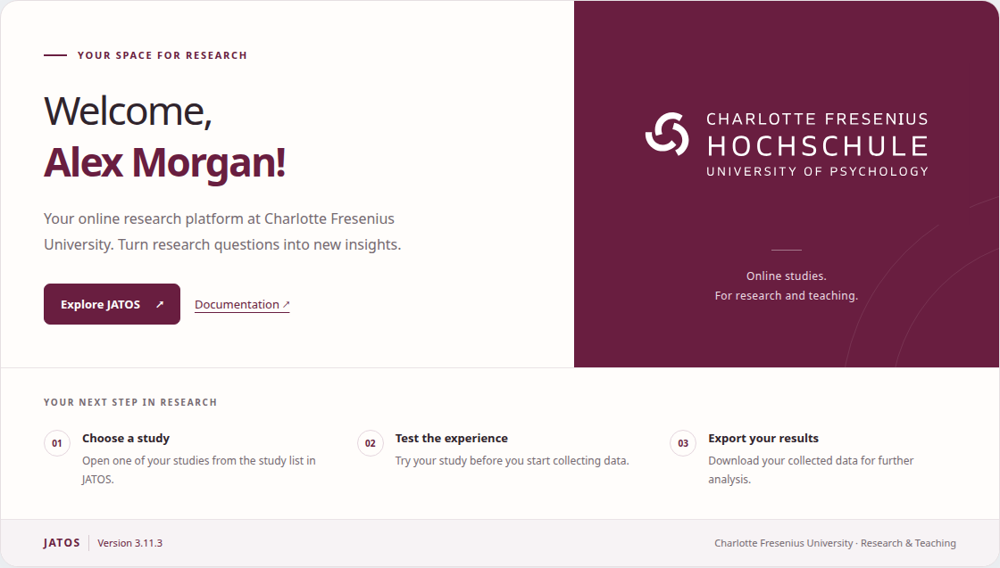

# JATOS · Charlotte Fresenius Hochschule

A responsive, English-language welcome panel for the JATOS home page, based on [JATOS/customized-home-page-template](https://github.com/JATOS/customized-home-page-template).

Uses the supplied Charlotte Fresenius Hochschule logo and its burgundy colour (#691E40), a personalized greeting, and the running JATOS version. Styles are scoped to the welcome panel. No JavaScript, tracking, external fonts, or external image requests are required.



## Install

Add this setting to your JATOS installation's `conf/jatos.conf`:

```hocon
jatos.brandingUrl = "https://raw.githubusercontent.com/kristian-lange/jatos-fresenius-homepage/main/fresenius-welcome.html"
```

Restart JATOS and open the home page. The GitHub repository must be public for this unauthenticated URL to work; alternatively host the generated HTML at an HTTPS URL accessible to your JATOS server. Later updates may be cached by JATOS or GitHub; a fresh sign-in requests fresh branding in supported JATOS versions.

JATOS substitutes `@USER_NAME` and `@JATOS_VERSION` on the server. Do not replace these placeholders with real user data. This is an HTML fragment loaded into JATOS, not a replacement for its navigation, study list, or permissions.

## Preview and edit

Open `preview.html` in a browser for a standalone design preview. Its name and version are explicitly marked as sample data, and are not live values.

Edit `home.template.html`, then rebuild with Python 3 (no third-party dependencies):

```sh
python3 scripts/build.py
```

Commit the template and both generated HTML files. The build embeds the original `assets/charlotte-fresenius-logo.svg` as a data URI, so the branding works regardless of JATOS's URL path prefix. Custom content-security policies must allow inline styles and `data:` images, consistent with this branding approach.

The layout stacks on narrow screens, wraps long names, supports keyboard focus and reduced motion, and uses system fonts. Modern browsers support the `:has()` selector used to remove the stock JATOS branding container's padding; older browsers retain that extra padding.

## Attribution and rights

The original template's Apache-2.0 license is retained in `LICENSE`. This adaptation replaces its sample university content and design. The supplied university logo remains the property of its respective rights holder and is not relicensed by the code license. Its presence does not imply endorsement.
